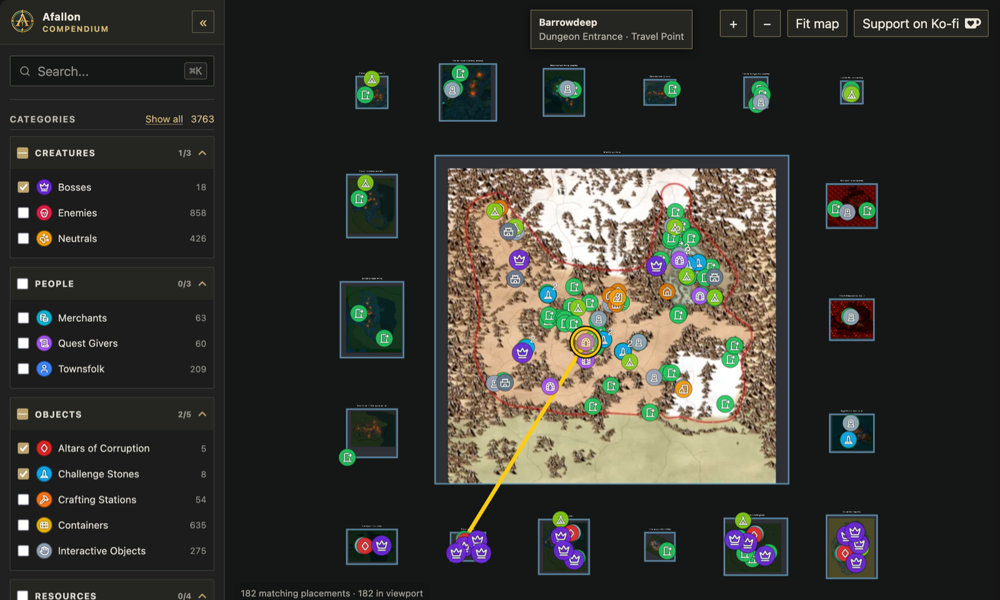

# Afallon Compendium

An interactive world map and searchable reference for more than 3,700 locations of the single-player RPG [Afallon](https://store.steampowered.com/app/2597810/Afallon/).

[Open the map](https://afallon.compendiums.org/) · [Steam guide](https://steamcommunity.com/sharedfiles/filedetails/?id=3800843227) · [Project page](https://glockyco.com/projects/afallon/)



## About

Search and filter bosses, dungeons, merchants, quest givers, resources, and other points of interest across the overworld and interior maps. The Adventure Guide provides dedicated pages for bosses, dungeons, regions, and properties.

The pipeline uses [HotRepl](https://github.com/glockyco/HotRepl), a runtime C# REPL for Unity games, to execute C# extraction probes inside the running game. Repository tooling validates the probe output, normalizes it into a shared world coordinate system, and builds a static publication for the SvelteKit and deck.gl site.

## Development

Development requires [Bun](https://bun.sh/). Install dependencies and run the repository checks from the project root:

```sh
bun install
bun run check
bun test
cd site && bun run check
```

The site requires a generated publication. Stage a local publication run, then start the development server:

```sh
cd site
bun run stage:production /path/to/publication-run
bun run dev
```

## Data pipeline

Runtime extraction requires a locally installed copy of Afallon with the HotRepl host loaded. [`config.example.json`](config.example.json) lists the required runtime paths and connection settings.

The pipeline writes versioned extraction, normalization, imagery, and publication artifacts under `artifacts/`. Generated artifacts, local configuration, and extracted game assets are not committed.

## License

This project is licensed under the [MIT License](LICENSE).

Afallon Compendium is an unofficial fan project and is not affiliated with the developer or publisher of Afallon. Afallon and its related names, artwork, and assets belong to their respective owners.
