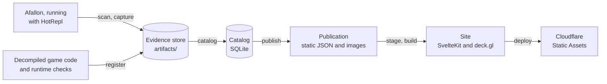

# Afallon Compendium

An interactive world map and a searchable compendium for the single-player RPG [Afallon](https://store.steampowered.com/app/2597810/Afallon/), built from the game's own data.

[Open the compendium](https://afallon.compendiums.org/) · [Steam guide](https://steamcommunity.com/sharedfiles/filedetails/?id=3800843227) · [Project page](https://glockyco.com/projects/afallon/)


The published site covers Afallon 0.16.3 (Steam build 25653798).

## What it offers

- **Map** (`/map/`). The game's own drawn maps of the overworld and its interiors, with every creature, merchant, quest giver, resource, container, and doorway that the scans place on them, plus category filters and search.
- **Reference pages** (`/<kind>/<slug>/`). A page for every item, NPC, quest, place, property, ability, class, skill, and gathering node, with where to find it, what it drops or sells, and how the pages relate. World Quest pages show their zones and timing. Each kind has a filterable list at `/<kind>/`, and the quest list can filter World Quests. Recipes have a list whose crafts show on the pages of their products. The Items, NPCs, and Abilities lists keep entries without a known source, world encounter, or use behind a counted reveal with a plain explanation.
- **Mechanics** (`/mechanics/`). Character Progression, Heroic Tier, Crafting and Gathering, Corruption, Loot, Adventurers, and World Quests explain how the game works. Character Progression uses a remembered level to show experience to the next level, a conditional creature-kill comparison, and progress through the published level curve. The full chart and breakpoints remain available. World Quests covers zone rotation, automatic participation, rewards, and Heroic Cache currency. Entity pages link the section that explains their numbers.
- **Coverage** (`/coverage/`). What the data covers and which pages have known gaps.

Every fact comes from the game's data or from game code that was read and verified for the supported build. A rule that is not verified is labelled unknown instead of guessed.

## How it works


```mermaid
flowchart LR
  game["Afallon, running<br/>with HotRepl"] -->|scan, capture| store[("Evidence store<br/>artifacts/")]
  native["Decompiled game code<br/>and runtime checks"] -->|register| store
  store -->|catalog| catalog[("Catalog<br/>SQLite")]
  catalog -->|publish| publication["Publication<br/>static JSON and images"]
  publication -->|stage, build| site["Site<br/>SvelteKit and deck.gl"]
  site -->|deploy| host["Cloudflare<br/>Static Assets"]
```

1. **Scan and capture.** [HotRepl](https://github.com/glockyco/HotRepl), a C# REPL inside the running Unity game, runs the probes under `packages/scan` and `packages/capture`. Scans visit each scene and read the game database, the authored world objects, and the artwork. Captures render map imagery.
2. **Evidence.** Every run writes immutable, content-addressed objects with a run manifest to the store. Plans and later steps cite objects by their hash, so any result can be traced to its inputs. Reviewed inputs, such as the map layout, the coverage review, and the record of verified game rules, are registered the same way.
3. **Catalog.** `catalog` validates the evidence into one SQLite database, the source of truth for everything that follows. It records what it could not resolve as coverage issues instead of dropping it.
4. **Publication.** `publish` turns the catalog into a static graph of JSON documents, lists, map parts, and sized WebP artwork, checks the graph, and selects it as a candidate.
5. **Site.** A publication is staged into `apps/site`, which prerenders every page and serves the map from the staged files. No database or game access is needed at run time.

### Concepts worth knowing

- **Identity.** A database record, an authored world object, a placement on a map, and a live game object are different things with different identities. Runtime instance ids, names, and coordinates are observations, not keys. A placement that cannot be matched to its authored source stays unresolved rather than guessed.
- **Map spaces.** A scene of the game is not a map. Reviewed scene bindings and horizontal frames decide which map a placement belongs to. A position outside every map stays unresolved instead of moving to the nearest map.
- **Producers.** Spawners describe what can appear, not what is alive. A spawner keeps its options and weights whether or not anything is spawned when the scan reads it.
- **Coverage.** Reachability, extraction, and imagery are separate. A scene without results is not proof that the game has none, and the accepted build is published in preview mode until its coverage is complete.
- **Game rules.** Rules such as kill experience, loot rolls, or gathering odds rest on decompiled game code or a recorded runtime check. They live in a registered rules record, which the guides and entity pages render, so a number on the site always names its rule.

### Extending pages and guides

Register a paged kind's document schema and static schema ID in `PAGE_DOCUMENTS` in `packages/contracts/src/public/documents.ts`; its kind values, schema maps, static document union, and references derive from that declaration. Give it list and route metadata in `packages/publication/src/kind-registry.ts`, and implement its document and list projections. The exhaustive dispatch in `DetailPage.svelte` and `TooltipPresenter.svelte` requires both a page and a hover card.

Register a mechanics topic's ID, name, description, and Browse label in `MECHANICS_TOPIC_DEFINITIONS` in `packages/contracts/src/catalog/mechanics.ts`. Add the topic's document schema in `documents.ts`, its guide sections in `packages/publication/src/guide-sections.ts`, and its page component in `DetailPage.svelte`. The topic schema, publication labels, and site navigation derive from the definition.

## Repository layout

| Path | What it holds |
| --- | --- |
| `apps/site` | The SvelteKit site: pages, the deck.gl map, search, and deployment scripts. |
| `apps/compendium-cli` | `bun run compendium`, the operator command line for every pipeline step. |
| `packages/contracts` | Schemas of evidence, catalog facts, and public documents, and the formulas that the publication and the site share. |
| `packages/runtime` | The owned HotRepl connection: one client at a time, cleanup receipts, and game identity checks. |
| `packages/scan`, `packages/capture` | The in-game probes and the runs that scan scenes and capture imagery. |
| `packages/artifacts` | The content-addressed evidence store and its run manifests. |
| `packages/catalog` | Validation of evidence into the SQLite catalog. |
| `packages/publication` | Projection of the catalog into the static publication. |
| `tools/update` | Scripts that author plans and compare results during a game update. |
| `openspec` | Requirements (`specs/`) and the reasoning behind each change (`changes/`). |
| `.agent/skills` | Step-by-step procedures for game updates, runtime inspection, and native analysis. |

Game binaries, recovered code, saves, raw evidence, and extracted images never enter Git. The store (`artifacts/`), local configuration and research notes (`local/`), and decompiled code (`research/`) are ignored.

## Getting started

Development needs [Bun](https://bun.sh/). The Nix flake's default shell (`nix develop`) provides Bun, Node, SQLite, uv, and Python 3.13. Its `analysis` shell provides Ghidra for native analysis.

```sh
bun install
bun run check                      # type-check the packages
bun run check:dependencies         # check the module boundaries
bun run test                       # package and site tests, and the Python tests
bun run --cwd apps/site check      # type-check the site
```

### Run the site

The site needs a staged publication. The repository holds none, because a publication comes out of the data pipeline below. Stage one into this checkout, then start the development server:

```sh
bun run stage:production <publication-root> <accepted-publication-directory>
bun run dev
```

Staging verifies the candidate against the accepted publication that the second argument names (or `PUBLICATION_BASELINE_ROOT`), and refuses one that drops placements, maps, imagery, offsets, or search records that its exclusion list does not name. It writes into the `apps/site` of the checkout that runs it, so each checkout and worktree needs its own stage. After a public schema change, stage a publication built from the current commit, or the development server reports that a resource does not match its schema.

Production builds need `SITE_STAGE=production`: `bun run build:production`. The development server uses `apps/site/.svelte-kit`, while the site's type check writes to `.svelte-kit-check`, builds and `bun run preview` use `.svelte-kit-build`, and tests that start Vite use `.svelte-kit-test`, so checking, building, or testing never disturbs a running development server. `bun install` creates `apps/site/.svelte-kit` when it is missing, because the site's `tsconfig.json` and the tests read the files SvelteKit generates there.

Marker glyphs use the checked-in `apps/site/static/map-marker-icons.png` sprite and its mapping. After changing a marker icon, color, or category, run `bun --cwd apps/site scripts/generate-map-icons.ts` with Playwright Chromium installed (or `PLAYWRIGHT_CHROMIUM_EXECUTABLE` pointing to a Chromium binary), then commit both generated files.


## Data pipeline

Runtime steps need a local copy of Afallon with the HotRepl host loaded. [`config.example.json`](config.example.json) lists the paths and connection settings. Every command runs from the project root:

| Command | What it does |
| --- | --- |
| `bun run compendium update --config <file> --version <release>` | Installs a game build through Steam and records a receipt. |
| `bun run compendium recover --config <file> --cpp2il <binary>` | Recovers the game's type declarations for comparison with the accepted build. |
| `bun run compendium scan --config <file> --plan <file>` | Visits scenes in the running game and stores their evidence. |
| `bun run compendium capture --config <file> --plan <file>` | Captures terrain imagery. `pyramid` tiles it and `game-map` stores the game's drawn maps. |
| `bun run compendium register --store <dir> --build <id> --file <file>` | Stores a reviewed input, such as a rules record or a coverage review. |
| `bun run compendium catalog --store <dir> --plan <file>` | Builds the SQLite catalog from the evidence that the plan names. |
| `bun run compendium publish --store <dir> --output <dir> --plan <file>` | Builds and selects a static publication from a catalog. |
| `bun run compendium accept-update --store <dir> --report <file> ...` | Accepts a checked candidate as the new build, from an update report. |
| `bun run compendium clean --store <dir>` | Lists the intermediate manifest revisions of finished runs, and deletes them with `--apply`. |

Add `--candidate` to scan, capture, catalog, or publish to produce a verified result without replacing the selected one. Only scan and capture need the running game.

### Game updates

A new game build goes through the whole pipeline as a candidate and is compared with the accepted build before `accept-update` selects it. The [game-update skill](.agent/skills/game-update/SKILL.md) gives the steps, scripts, arguments, and failure modes. In short: install and compare declarations, scan, rebuild the maps and imagery, catalog, review every rule against the new build, publish, check the site in a browser, write the update report, and accept.

## Deployment

```sh
bun run stage:production <publication-root> <accepted-publication-directory>
bun run compendium preview                      # build and serve the staged site with its production headers
bun run compendium deploy <publication-root>    # build, deploy to Cloudflare Static Assets, and smoke-test
```

`deploy` stages the selected publication, builds and validates the site, deploys it with Wrangler, and smoke-tests production. Production has no database access, runtime probes, or development panels.

To rehearse a rollback locally, `bun run verify:deployment <current-publication-root> <previous-publication-root>` builds and checks both publications and returns the stage to the current one. `bun run rollback:production` rolls the deployed site back with Wrangler.

## Further reading

- [`openspec/specs`](openspec/specs/) states what the site and the pipeline must do. Each change under [`openspec/changes`](openspec/changes/) records why it was made, and archived changes keep that history.
- [`.agent/skills`](.agent/skills/) holds the procedures for [game updates](.agent/skills/game-update/SKILL.md), [runtime inspection](.agent/skills/hotrepl-runtime-inspection/SKILL.md), and [native analysis](.agent/skills/native-analysis/SKILL.md).
- Commit messages explain why each change exists, and code comments cite the game rule that a piece of code implements.

## License

This project is licensed under the [MIT License](LICENSE).

Afallon Compendium is an unofficial fan project and is not affiliated with the developer or publisher of Afallon. Afallon and its related names, artwork, and assets belong to their respective owners.
