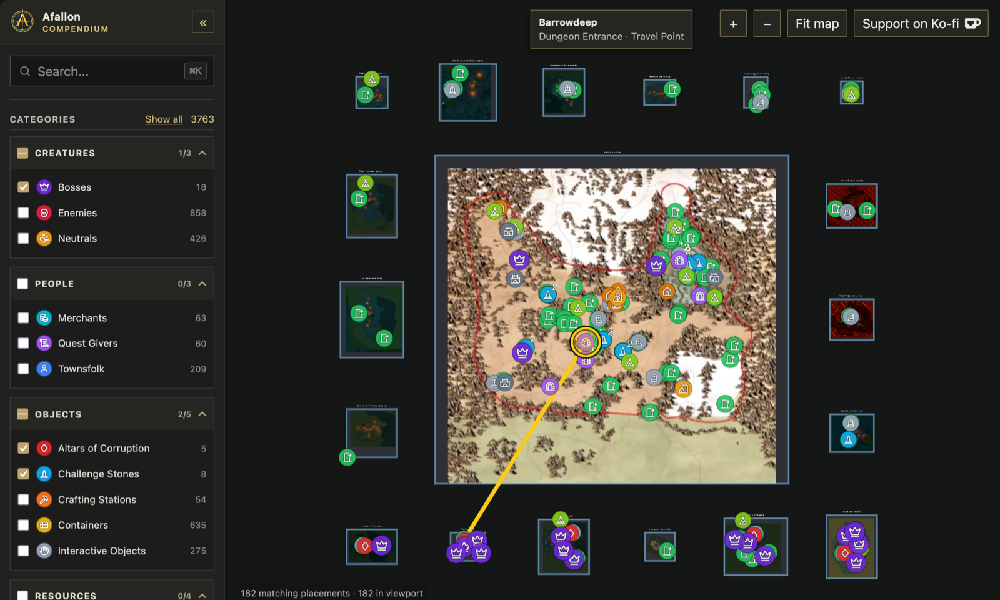

# Afallon Compendium

An interactive world map and a searchable compendium for the single-player RPG [Afallon](https://store.steampowered.com/app/2597810/Afallon/): more than 3,700 mapped locations and a page for every item, creature, quest, place, property, ability, recipe, class, and skill in the supported build.

[Open the compendium](https://afallon.compendiums.org/) · [Steam guide](https://steamcommunity.com/sharedfiles/filedetails/?id=3800843227) · [Project page](https://glockyco.com/projects/afallon/)



## About

Search and filter bosses, dungeons, merchants, quest givers, resources, and other points of interest across the overworld and interior maps.

The home page at `/` starts with search and leads to the map, the places by level range, the classes, crafting and gathering, and every list. The map is at `/map/`. The bar links Map, Items, Recipes, Quests, Classes, and Skills, and its Browse menu lists every destination. The compendium gives each published entity a page at `/<kind>/<slug>/` and each kind a filterable list at `/<kind>/`. Items, NPCs, quests, places, properties, abilities, classes, skills, and gathering nodes have pages. Recipes have a list, and each craft shows on the page of its product. Mechanics pages under `/mechanics/` explain character progression, the Heroic tier, crafting and gathering, and corruption step by step, and entity pages link the step that applies to them. Every page names the game release, the date of its data, and the patch notes of that release. A detail page starts with a title block and an answer to the main question for its kind, such as how to get an item. A side column shows the game tooltip or the secondary facts. Relation sections follow, and each shows eight rows before a "Show more" control. A page shows the relations of an entity in both directions, so an item names what drops, sells, and crafts it, and an NPC names what it drops. Currency item pages also show what merchants sell for that currency, including prices and sellers. Locations show as places with spot counts that link to the map. Relation links show a hover card with the facts of the counterpart. Each table explains its values in its column labels, so a reader needs no other page. A fact that the supported build does not establish shows a marked gap instead of a guess. `/coverage/` reports the published page counts and the pages with known gaps.

The pipeline uses [HotRepl](https://github.com/glockyco/HotRepl), a runtime C# REPL for Unity games, to execute C# evidence probes inside the running game. Repository tooling validates immutable evidence into a canonical SQLite catalog and builds a static publication for the SvelteKit and deck.gl site.

## Project knowledge

[`EXPLORATION.md`](EXPLORATION.md) records accepted-build game facts, evidence, and limits. Agent procedures live in [`.agent/skills/`](.agent/skills/), including runtime inspection and native analysis. This README gives operator commands. [`openspec/specs/`](openspec/specs/) and [`openspec/changes/`](openspec/changes/) hold requirements and design decisions.

## Development

Development requires [Bun](https://bun.sh/). Install dependencies and run the repository checks from the project root:

```sh
bun install
bun run check
bun run check:dependencies
bun test ./packages ./apps
bun run --cwd apps/site check
```

The site requires a selected static publication. Stage it from the project root, then start the development server:

```sh
bun run stage:production /path/to/publication-root
bun run build:production
SITE_STAGE=production bun run dev
```

Direct site builds also require `SITE_STAGE=production`. Without it the site has no staged resource graph and page prerendering fails.

Staging verifies the candidate against a baseline publication root, which the second argument or `PUBLICATION_BASELINE_ROOT` supplies. Both roots pass the same graph verification, so the baseline is a real publication rather than a retained aggregate file.

## Data pipeline

Runtime extraction requires a locally installed copy of Afallon with the HotRepl host loaded. [`config.example.json`](config.example.json) lists the required runtime paths and connection settings.

The workspace exposes one operator CLI:

```sh
bun run compendium scan --config local/config.json --plan local/scan-plan.json
bun run compendium capture --config local/config.json --plan local/capture-plan.json
bun run compendium catalog --store local/store --plan local/catalog-plan.json
bun run compendium publish --store local/store --plan local/publish-plan.json --output local/publication
```

Add `--candidate` to produce a verified result without changing the workflow's selected reference. `scan` and `capture` write immutable, content-addressed evidence. Scan also reads each sprite the database references for an item, creature, ability, recipe, scene, region, or property and stores it as evidence, from which publication derives the sized WebP artwork the pages show. `catalog` validates that evidence into the canonical SQLite source of truth. `publish` queries the catalog and atomically selects a static publication. Its reviewed presentation input holds the world offsets, the spatial bounds, and a list of internal records, such as test items, that the publication leaves out. Each entry gives a reason and its evidence, and the publication fails when the catalog no longer supports the evidence. The map loads every map shard together at its reviewed world offset. Publication emits one typed document per entity, a partitioned list per kind, one search corpus shared by the map and the pages, and content-addressed artwork; every reference in a document is resolved and audited before a candidate is selected, so the site never resolves a name or builds a link of its own. Game-provided maps are enabled by default; captured terrain is available only when a reader selects it.

Map-data readiness waits for every declared geometry part. Search loads independently, and overlay toggles use geometry that is already loaded. The 3,300,000-byte essential-resource budget excludes geometry; actual map-ready JSON transfer includes it. Pan stops on mouse or touch release. Selection does not move the camera.

### Game updates

A new game build is installed, compared, scanned, captured, catalogued, and published as a candidate before `accept-update` selects it. The full procedure, with its failure modes, is the [`game-update` skill](.agent/skills/game-update/SKILL.md). In short:

1. `bun run compendium update` installs the build through Steam and records a receipt. `recover` and `tools/update/compare-declarations.ts` compare the game's declarations with the previous build.
2. `scan` reads each scene. `author-scan-arrivals.ts` gives each scene an observed doorway from the accepted catalog as its arrival.
3. `author-map-profile.ts`, `sweep-map-zones.ts`, `author-game-map-plans.ts`, `extract-overworld-texture.py`, `author-overworld-plan.ts`, `author-capture-plans.ts`, and `capture-plans.ts` produce the map spaces and imagery.
4. `author-bootstrap-review.ts`, `author-catalog-plan.ts`, and `author-coverage-review.ts` produce the coverage review and the catalog plans. `compare-catalogs.ts` compares the new catalog with the accepted one.
5. `publish`, `stage:production`, and a browser check produce the candidate. An update report and `accept-update` select it.

Each script in [`tools/update/`](tools/update/) prints its usage when it is started without arguments. Scan plans set `streamedSources: "all"` on build-scene targets whose streamed sources should all load before collection.

Generated artifacts, local configuration, and extracted game assets are not committed.

## Deployment

Preview or deploy a selected publication from the project root:

```sh
bun run stage:production /path/to/publication-root
bun run compendium preview
bun run compendium deploy /path/to/publication-root
```

The preview command builds the staged publication before serving it. Staging rejects a candidate that removes deployed placements, map regions, imagery tiles, map spaces, reviewed offsets, or a search record that the exclusion list of the candidate does not name. The deploy command stages the selected immutable publication, builds and validates `apps/site`, deploys Cloudflare Static Assets with Wrangler, and smoke-tests production. Production excludes database access, runtime probes, authoring controls, and development detail panels.

Producer selection and deployment share the public graph semantics. Each boundary still verifies its own files or stored objects. Parity checks consume the verified candidate resources and independently read the tracked baseline. A retained publication can pass graph verification but fail the current parity gate; do not bypass that gate for rollback.

To rehearse a local rollback without deploying:

```sh
bun run verify:deployment /path/to/current-publication-root /path/to/previous-publication-root
```

This command replaces the local production stage, builds and checks both publications, restores the previous identity, and returns the stage to the current identity. Both inputs must pass the current parity gate. Use a separate checkout when the existing local stage must remain untouched.

## License

This project is licensed under the [MIT License](LICENSE).

Afallon Compendium is an unofficial fan project and is not affiliated with the developer or publisher of Afallon. Afallon and its related names, artwork, and assets belong to their respective owners.
