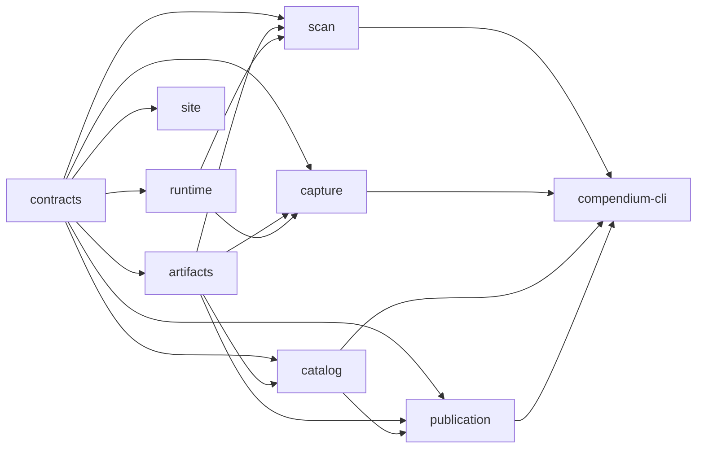

## Context

See `proposal.md` for motivation. The current implementation has sound runtime ownership, build-scoped run manifests, stable domain identities, strict SQLite constraints, and a static deck.gl/SvelteKit delivery model. Those mechanisms remain authoritative.

The structural problem is dependency direction. Pipeline code imports tools, tools import pipeline code, and the site imports pipeline internals. Extraction and traversal separately implement probe compilation, evidence collection, artifact registration, validation, identity, roles, spatial processing, and coverage. Schema identities and implementation hash inputs are repeated across commands. Normalization accepts untrusted records through `any`, while publication materializes large projection documents beside the canonical database. The main publication module, map adapter, and map component each own several unrelated responsibilities.

Current successful artifacts are large enough that copying inputs and producing whole-catalog JSON projections is material: one representative normalized run is about 535 MB, including a 327 MB map projection, while its static publication is about 5 MB. The design must reduce intermediate I/O without weakening provenance or coverage gates.

The related `build-screenshot-first-map` change is still active, so its capability specs are not archived under `openspec/specs/`. This change is an architectural successor, not a replacement for its evidence, coverage, capture, or product requirements. Where that older change describes captured terrain as the default, the user's newer decision controls: game-provided imagery is the default everywhere, and capture is optional and user-enabled.

## Goals / Non-Goals

**Goals:**

- Make dependency direction visible in the filesystem and mechanically enforce it.
- Give every workflow one composition root and every domain concern one owner.
- Remove copied run artifacts and manually synchronized implementation hash lists.
- Make invalid runtime data unable to enter the trusted catalog.
- Make the catalog the sole normalized boundary for validation and publication.
- Preserve runtime restoration, evidence provenance, stable identity, and strict release gates.
- Bound browser downloads by map, index, and selected detail instead of catalog size.
- Provide an atomic migration with measured semantic parity and a simple rollback.

**Non-Goals:**

- A reusable extraction framework for other games.
- A service-oriented architecture, request-time API, worker, account system, or hosted database.
- A permanent gameplay mod or a new runtime protocol.
- A floor model, inferred facts, relaxed coverage, or automatic blocker suppression.
- Public production detail panels or authoring controls.
- Automatically enabling captured terrain.
- Re-solving research blockers already recorded in the evidence ledger.

## Decisions

### 1. Use a Bun workspace modular monolith

The repository will use these ownership units:

```text
apps/
  compendium-cli/       command parsing and workflow composition only
  site/                 SvelteKit static application
packages/
  contracts/            TypeBox schemas, derived types, IDs, and canonical JSON
  artifacts/            content store, run manifests, references, fingerprints
  runtime/              HotRepl connection, exclusive owner, cleanup protocol
  scan/                  Afallon target plans, collectors, and raw evidence output
  capture/               Afallon capture plans, readiness, rendering, tile evidence
  catalog/               validated ingestion, SQLite assembly, queries, gates
  publication/           static resource and imagery generation
```

Allowed dependencies form one directed graph:



Arrows mean "is imported by." `apps/compendium-cli` is the only host-side composition root. `apps/site` may import only the public subpath of `packages/contracts`; it cannot import catalog, publication, or CLI source. Scan and capture do not import catalog queries. The CLI obtains any catalog-derived plans and passes validated values into those packages.

Each package exposes a small `exports` surface. Cross-package relative imports and unexported package paths are forbidden. TypeScript project references check package contracts; dependency-cruiser enforces the graph and rejects cycles in continuous integration.

This keeps one deployable tool and one static site. Separate services would add failure modes without independent scaling or deployment needs. Keeping the existing top-level folders with conventions alone was rejected because the present cycles show that conventions do not enforce ownership.

### 2. Keep HotRepl scripts, but make probe bundles explicit

The runtime package keeps the current host lock, owner token, runtime-side cleanup callbacks, frame-local restoration, cancellation, disconnect handling, and cleanup receipt. Those are safety invariants, not refactoring opportunities.

Game code remains Afallon-specific C# submitted through HotRepl. A compiled project was rejected because a portable build cannot resolve the proprietary runtime assemblies, and a permanent loaded assembly would create a new deployment and cleanup surface. Instead, each collector owns a deterministic probe bundle made from explicit source imports:

- shared support and serialization;
- the collector's game-specific inspection code;
- the collector entry expression;
- the declared raw output schema identity.

The bundler hashes every imported probe source and submits one bounded Roslyn compilation per collector per runtime session. Probe modules return raw evidence only. They do not normalize identities, infer roles, update coverage, or write publication data. Large scripts are split along inspection, traversal, serialization, and cleanup boundaries while preserving one runtime entry expression.

This removes the duplicated compile-and-collect paths without inventing a plugin model. Collector registration is a closed Afallon union in `packages/scan`, not dynamic discovery.

### 3. Replace extraction and traversal with one target-driven scan

The CLI command becomes `compendium scan`. Its validated plan contains an ordered list of targets:

```ts
type ScanTarget =
  | { kind: "current-scene" }
  | { kind: "scene"; sceneId: number; scenePath: string }
  | { kind: "stream-source"; sourceId: string; ownerSceneId: number };
```

All targets run through the same state machine:

```text
validate plan -> acquire owner -> prepare target -> collect artifact families
-> validate raw envelopes -> record target outcome -> restore target state
-> confirm owner cleanup -> finalize run
```

Collectors declare applicability by target kind. An inapplicable family produces an evidence-backed disposition. Unsupported, unreachable, failed, and not-attempted remain distinct. Current-scene scans and planned traversal scans therefore cannot drift into different schemas or coverage semantics.

Capture remains a separate command because it mutates visual state, has different readiness and resumability rules, and emits image evidence. It reuses `packages/runtime` and `packages/artifacts`, not scan orchestration.

A generic job graph or plugin registry was rejected. The workflows are few, ordered, and game-specific; an explicit state machine is easier to audit and restore.

### 4. Store content once and reference it from immutable runs

The artifact root uses three namespaces:

```text
objects/sha256/<first-two>/<remaining-hash>
runs/<run-id>/manifest.json
refs/<build-id>/<operation>/latest-success.json
```

Object creation writes a temporary file in the target filesystem, hashes while streaming, flushes it, and atomically renames it into the object namespace. If the object exists, the store verifies it before reuse. Manifests map logical artifact names to object hash, byte count, media type, schema identity, and build identity. They never copy object bytes into a run directory.

A run manifest is append-only while running and immutable after success or failure. Finalization verifies every referenced object before atomically replacing `latest-success`. Failed runs remain inspectable and cannot move that reference. Garbage collection traces from retained runs, latest-success references, and active-operation leases before deleting unreachable objects.

The existing build-scoped data remains read-only migration input. A migration importer hashes and registers those bytes without editing them. There is no long-lived legacy layout reader after cutover.

A database-backed artifact store was rejected. Large images and SQLite files are better served by the filesystem; only manifests and references need small structured documents.

### 5. Derive step fingerprints from executable dependency closure

Each workflow step has one entry module. The build tooling asks Bun for that entry's transitive bundle and metafile, then hashes:

- emitted executable bytes in stable output order;
- imported probe-source bytes;
- contract schema identities;
- validated step settings;
- input object identities.

Probe sources are executable imports of the owning collector, not a second manually maintained filename list. This makes a relevant transitive code change invalidate reuse while leaving unrelated site or workflow code outside the fingerprint.

The step result records both its implementation fingerprint and complete cache key. Reuse verifies the prior manifest and every output object. A repository revision string remains diagnostic metadata but is not a cache key because it invalidates unrelated steps.

Hashing the whole repository was rejected because it destroys useful reuse. Hand-maintained arrays were rejected because omitted dependencies silently reuse stale evidence.

### 6. Establish one schema registry and a strict trust boundary

`packages/contracts` owns each schema, its derived TypeScript type, its stable schema identity, and canonical serialization. There is one exported declaration for each schema identity. Raw JSON is `unknown` until TypeBox validation succeeds. Normalizers accept only derived validated types; `Record<string, any>` and `any[]` are prohibited in trusted packages.

Validation errors include object identity, schema identity, JSON path, and target context. Assembly starts only after all required inputs validate. Optional, absent, unknown, unsupported, and failed values remain separate variants where the domain distinguishes them.

Schemas are grouped by boundary, not command:

- raw runtime evidence;
- reviewed evidence and plans;
- canonical catalog inputs and query rows;
- public static resources;
- manifests and lifecycle records.

Duplicating TypeScript interfaces beside runtime schemas was rejected because they can diverge. Letting SQLite coercion validate values was rejected because it loses the source record path and can partially transform bad evidence.

### 7. Make catalog assembly transactional and publication read it directly

Catalog assembly creates a new SQLite object for one build; it never migrates the selected database in place. It validates all inputs, opens one transaction, inserts deterministic ordered rows, runs foreign-key and domain gates, commits, and seals the database. Failure discards the candidate and preserves the selected catalog.

The logical `catalogId` is the hash of canonical metadata: build, catalog schema, validated input object identities, reviewed settings, and assembler fingerprint. The SQLite file also has its own content hash. This separates logical equivalence from incidental SQLite page layout while preserving byte integrity.

The relational model keeps the proven separation among canonical entities, authored sources, placements, runtime observations, roles, conditions, and spatial registration. JSON columns remain only for evidence whose internal structure is not queried or constrained. Frequently filtered identifiers, states, and relations become typed columns with foreign keys and checks.

Coverage becomes two relations:

```text
coverage_issues(issue_id, build_id, kind, subject_key, state,
                resolution_evidence, first_seen_run, last_seen_run)
coverage_occurrences(occurrence_id, issue_id, artifact_hash, source_key,
                     record_path, evidence_json)
```

`issue_id` is derived from build, issue kind, stable subject identity, and semantic discriminator. Detail wording is not identity. Gates count unresolved issue rows. Reports may show occurrence counts, but label them separately.

Publication uses read-only catalog query modules that return public contract rows in deterministic order. It does not read map projection, entity-detail, item-source, or coverage-summary intermediates. Those documents are deleted after parity cutover.

Keeping both SQLite and projection JSON as normalized authorities was rejected because their identities and validation can diverge. Treating every diagnostic occurrence as a blocker was rejected because repeated evidence inflates release state.

### 8. Publish content-addressed static shards

`packages/publication` produces a root manifest plus content-addressed resources:

```text
atlas.json
assets/data/maps/<map-id>/<hash>.json
assets/data/index/entities-<hash>.json
assets/data/index/items-<hash>.json
assets/data/entities/<prefix>/<entity-key>-<hash>.json
assets/data/items/<prefix>/<item-key>-<hash>.json
assets/data/coverage/<hash>.json
assets/imagery/<hash>.webp
```

The root contains build and catalog identities, schema versions, map summaries, bounds, layer metadata, resource URLs, hashes, and counts. Map shards contain only that map's placements, regions, and connections. Compact global indexes support search without shipping detail bodies. Details and item-source records load by selected key. Filenames include content hashes, so Cloudflare may cache them immutably; only the selected root needs short-lived cache behavior.

Publication writes a candidate directory, validates every referenced resource and release gate, then atomically selects it. SvelteKit copies only selected publication files into its static build. The browser verifies manifest/schema compatibility; deployment verification checks file hashes before upload.

One monolithic projection was rejected because its memory and transfer cost grows with unrelated maps and details. Runtime queries were rejected because the static data set does not justify a service.

### 9. Separate atlas state, loading, rendering, and presentation

The site uses four boundaries:

- `atlas-state`: immutable URL-backed state transitions and selectors;
- `atlas-data`: root manifest, map shard, index, and detail loading with request deduplication;
- `map-renderer`: deck.gl lifecycle, view synchronization, hit testing, and WebGL failure handling;
- Svelte components: sidebar, results, layer controls, canvas shell, and development details.

Layer constructors are separate pure modules for imagery, markers, regions, connections, and movement. They receive public rows and state; they do not fetch, mutate URLs, or own Svelte state. The renderer owns deck.gl resources and disposes them on replacement or component teardown.

`MapExplorer.svelte` remains the page composition shell rather than the data store and renderer implementation. The production detail panel and authoring controls remain inside a compile-time `dev` branch. The refactor does not make them public.

Default-layer selection is a pure policy: select all applicable `game-map` layers for the initial map and select no `captured` layer unless canonical saved state explicitly names it. This applies to overworld and interiors. Switching layers preserves world coordinates and selection.

URL parsing accepts only the canonical parameter set. The singular legacy `layer` alias and other deprecated forms are removed at cutover rather than retained as compatibility branches.

Replacing deck.gl or SvelteKit was rejected because neither causes the current ownership problem. Adding a client state framework was rejected because a typed reducer and derived selectors are sufficient.

### 10. Prove parity at boundaries, not by preserving files

Migration parity compares observable semantics from a frozen successful build:

- run failure and latest-success behavior;
- raw record families, target outcomes, and stable source identities;
- canonical entity, placement, relation, exclusion, distinct issue, and occurrence counts;
- sampled canonical rows and provenance chains;
- map bounds, layer registrations, marker coordinates, and tile hashes where inputs are unchanged;
- public search, filters, selections, canonical URL round trips, default layers, and development gating;
- preview and release gate outcomes.

Expected differences are declared before comparison: normalized issue totals replace occurrence-inflated totals; static filenames and resource grouping change; deprecated commands, paths, and URL aliases disappear; game imagery remains the default even where the older planning text said otherwise.

The unified current-scene run `f6ad6218-d221-48cb-812f-408ed8a7c4dc` was compared with frozen extraction run `1b0a696b-b55c-40e6-ab0c-cb21bba4c944`. All 12 legacy raw families are present. Canonical, localization, loot-rule, relationship, and support bytes are identical. Faction, geometry, producer, placement, inventory, and world-source bytes differ only in live observation fields, such as frames, runtime instance IDs, and the current roaming actors. The unified run adds addressable-location and target-coverage evidence and stores a validated observation context for every runtime collector. Its target envelope succeeded. The same unified collector list also ran for current-scene and build-scene targets, while the frozen traversal used a smaller per-step collector subset; the added families remove that legacy drift.

File-for-file equality was rejected because the new catalog layout and static sharding are intentional. Count-only parity was rejected because equal totals can hide identity or provenance regressions.

## Risks / Trade-offs

- [A single cutover touches most modules] → Build new packages behind fixture-driven boundary checks, keep the current CLI selected until end-to-end parity passes, then switch commands and delete old paths in one coherent change.
- [Content-addressed storage can retain orphaned large files] → Add reference-tracing garbage collection with active leases, dry-run reporting, and integrity verification before deletion.
- [Bun bundle output could create unstable fingerprints] → Pin Bun, normalize metafile ordering, hash emitted bytes rather than paths, and verify repeat fingerprints in separate clean directories.
- [Splitting probe bundles can change runtime timing or cleanup] → Preserve the runtime owner unchanged first, compare raw envelopes from the same scene, and exercise cancellation, disconnect, scene restoration, and frame cleanup before removing old probes.
- [A new SQLite layout can change fact semantics] → Import the same frozen evidence into both assemblers and compare stable identities, relations, provenance, exclusions, issue identities, and gate decisions before cutover.
- [Static sharding adds browser requests] → Keep root and search indexes compact, load map resources concurrently, cache content-addressed assets immutably, and measure first-map bytes and requests against the current publication.
- [Canonical URL cleanup breaks old shared links] → Treat this as the declared breaking cutover, document the canonical parameter set, and verify new links round-trip. Do not add a permanent alias reader.
- [The active earlier OpenSpec change contains a conflicting image-default statement] → Record the newer game-imagery policy in `static-publication`, update affected implementation tasks to follow it, and reconcile the older change before either change is archived.

## Migration Plan

1. Freeze one successful current build as read-only parity evidence. Record its manifests, object hashes, public behavior checks, and known unresolved coverage; do not copy it into Git.
2. Create the workspace package graph, public exports, project references, and dependency rules. Move no behavior until the graph checks can run.
3. Move contracts and schemas to `packages/contracts`. Migrate all callers to exported schema/type pairs and remove the old declarations in the same slice.
4. Implement the content store, immutable manifests, automatic fingerprints, refs, importer, and garbage-collection dry run. Register the frozen evidence and verify it without modifying source bytes.
5. Move the runtime owner unchanged into `packages/runtime`. Build the unified target scanner and probe bundles; prove current-scene and traversal parity, then remove the old extraction and traversal commands and duplicate collectors.
6. Build the new catalog from validated frozen evidence. Add issue/occurrence normalization and read-only query modules. Pass relational, identity, provenance, and gate parity before selecting the new catalog.
7. Generate static shards directly from catalog queries. Verify resource hashes, map registration, release behavior, and a production-like static build before removing normalized projection generation.
8. Refactor the site around the new public contracts, loader, state reducer, renderer, and focused Svelte components. Verify in the browser that game imagery is default, captured terrain is opt-in, URLs round-trip canonically, map interaction remains correct, and detail/authoring panels remain development-only.
9. Switch root commands and deployment input to the new composition root. Remove old modules, commands, copied artifact layouts, projection formats, deprecated URL parsing, and temporary parity adapters. Update operator documentation and reconcile the active older change's conflicting planning text.
10. Run focused smoke scenarios, package checks, the complete existing suite, a static production build, dependency-cycle validation, and artifact integrity validation. Select the new successful refs only after all pass.

Rollback is a source revision rollback plus restoration of the previous latest-success and selected-publication references. Old evidence and publications remain immutable until the new architecture has completed a successful release and its retention window. No database or artifact is modified in place, so rollback does not require reverse migration.
